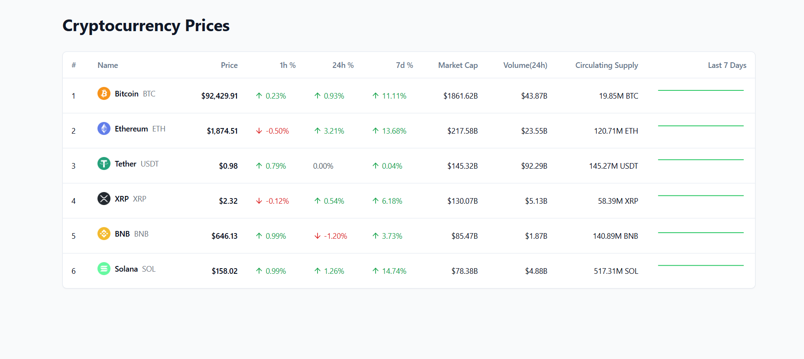

# Crypto Price Tracker

A real-time cryptocurrency price tracking application built with React and Redux. Track live prices, market caps, and price changes for major cryptocurrencies with a clean, responsive interface.



## Features

- Real-time price updates
- Track 6 major cryptocurrencies (BTC, ETH, USDT, XRP, BNB, SOL)
- Live percentage changes (1h, 24h, 7d)
- Market cap and volume tracking
- Responsive design for all devices
- Color-coded price changes

## Tech Stack

- React
- TypeScript
- Redux Toolkit for state management
- Tailwind CSS for styling
- Shadcn/UI components
- Recharts for data visualization

## Getting Started

1. Download or clone the project
```bash
git clone https://github.com/hirendrasai/Crypto_Price_Tracker.git
```

2. Install dependencies
```bash
npm install
```

3. Start the development server
```bash
npm run dev
```

## Project Structure

```
src/
├── components/      # React components
├── store/          # Redux store and slices
├── services/       # WebSocket simulator and other services
└── types/          # TypeScript type definitions
```

## Contributing

Feel free to submit issues and pull requests.

## License

MIT License - feel free to use this project however you'd like.
